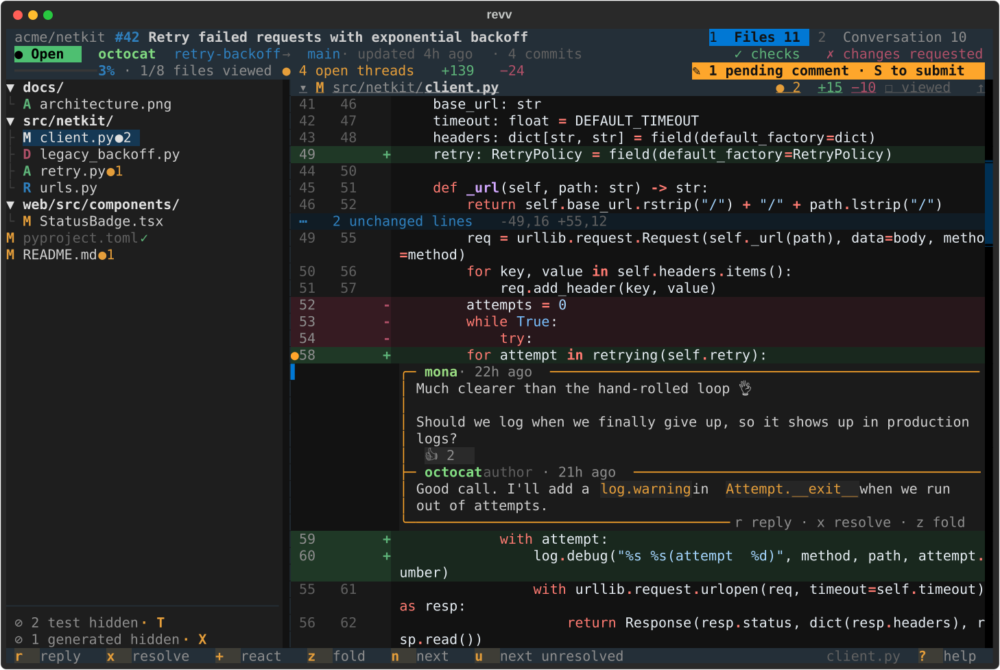
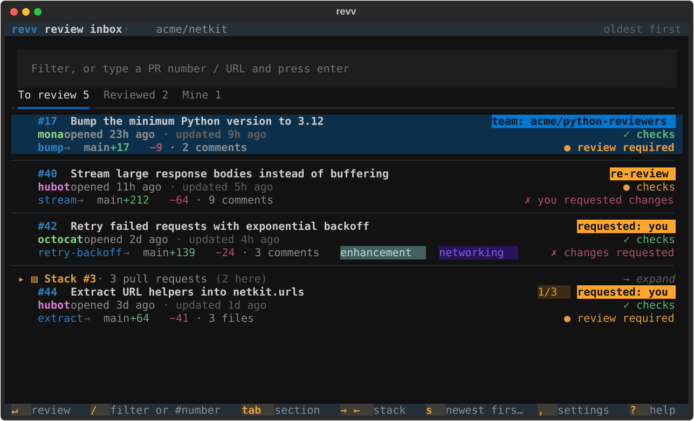
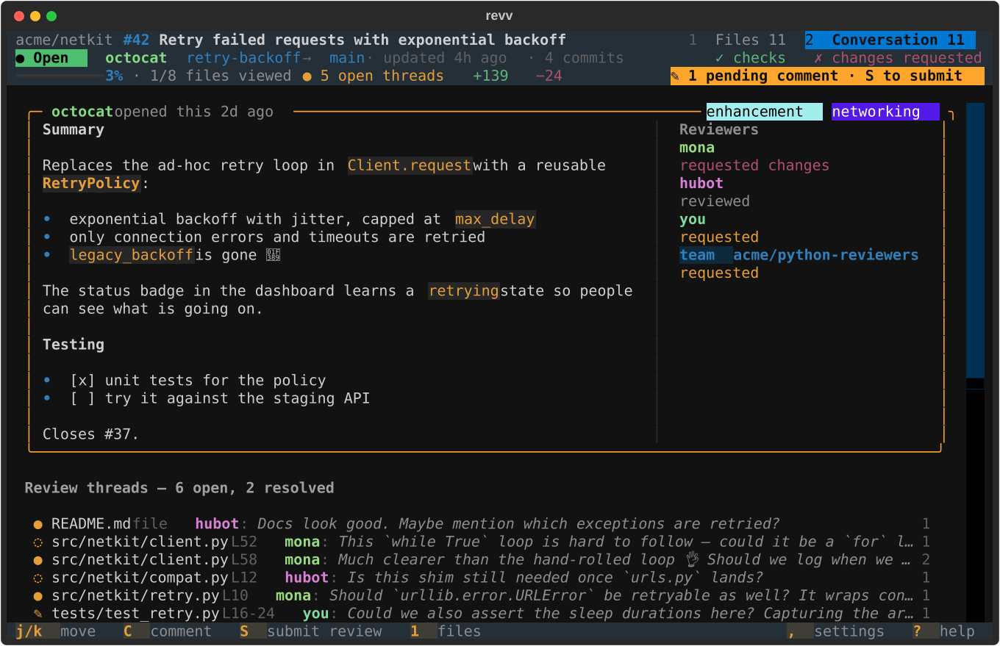
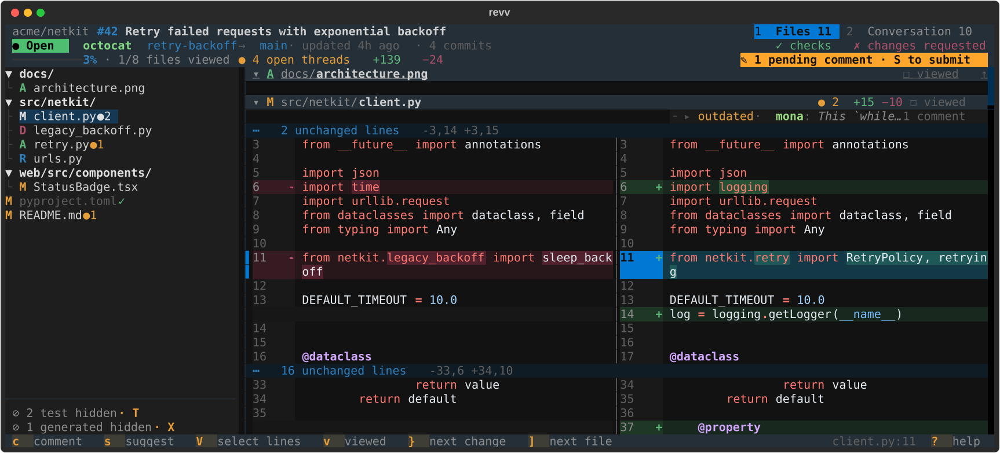
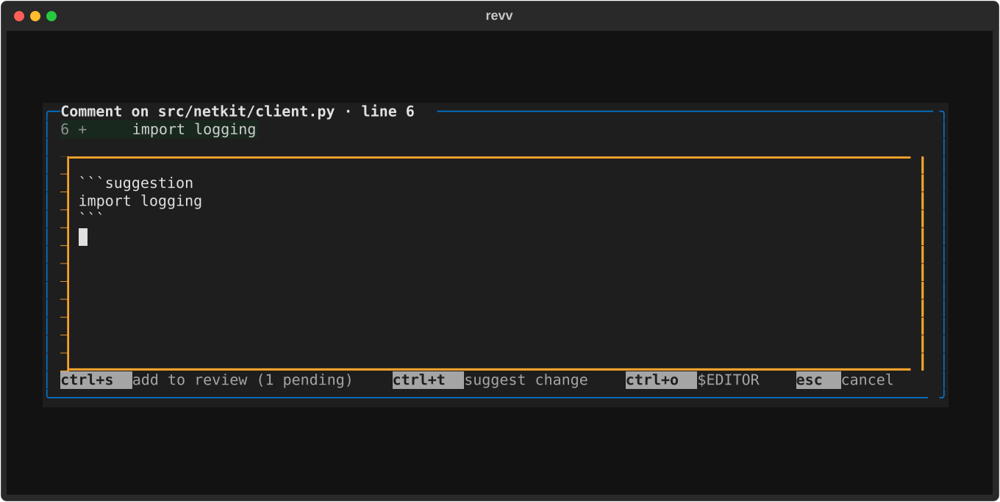

<h1 align="center">revv</h1>

<p align="center">
  <b>Review GitHub pull requests without leaving your terminal.</b><br>
  A fast, keyboard-driven code review app: your review inbox, a diff that reads well,
  and every comment, reply, resolve and verdict one key away.
</p>

<p align="center">
  
  <a href="https://textual.textualize.io"></a>
  <a href="https://github.com/astral-sh/uv"></a>
  <a href="https://github.com/astral-sh/ruff"></a>
</p>

<p align="center">
  
</p>

## Why revv

- **An inbox, not a firehose.** Run `revv` in a repository and you see only what involves
  you: review requests (yours or your teams'), pull requests assigned to you, ones you've
  reviewed, and your own. Stacked pull requests fold into one row. Anything else is one PR
  number away.
- **A diff that reads well.** Every file in one scrollable view, syntax-highlighted, with
  word-level highlighting of what changed on each line. Unified or side by side, expandable
  context, a file tree, and the current file pinned to the top as you scroll.
- **Comments where they belong.** Threads appear inline under their lines. Comment on a
  line, a range or a whole file, suggest changes, reply, edit, react, and resolve.
- **Reviews the GitHub way.** Comments go into a pending review, just like "Start a review"
  on github.com, so nothing is lost if you quit. Submit with Comment, Approve or Request
  changes, or post a single comment right away.
- **Made for real review sessions.** Mark files viewed (synced with GitHub) and see your
  progress weighted by changed lines. Test and generated files stay out of the way. `L`
  shows only what changed since your last review, and `u` hops between unresolved threads.
- **Instant, and never stale for long.** Pull requests and the inbox open from an on-disk
  cache, clearly marked, and sync with GitHub right away. While you read, revv checks every
  30 seconds whether anything changed and offers to refresh.

## Install

You'll need [uv](https://docs.astral.sh/uv/) and a GitHub login from the
[GitHub CLI](https://cli.github.com/) (or a `GH_TOKEN` / `GITHUB_TOKEN` environment variable).

```sh
uv tool install git+https://github.com/adamtrain/revv
gh auth login   # if you haven't already
```

## Usage

```sh
revv                  # your review inbox for the repository you're in
revv 123              # review pull request #123 of this repository
revv owner/repo#123   # any pull request (a PR URL works too)
revv owner/repo       # the inbox of another repository
revv --all            # your inbox across all repositories
revv --demo           # try it with built-in sample data, no network needed
revv --no-cache       # don't read or write the cache in ~/.cache/revv
```

GitHub Enterprise works too: revv follows the host of your git remote or the PR URL.

## A tour

<p align="center">
  
</p>

**The inbox** lists the oldest pull requests first (`s` flips it). Each row says why it's
there: requested from you, from one of your teams, assigned, or a re-review. A stack folds
into one row showing the next pull request to review; `→` or `↵` unfold it and `←` folds it
back. `i` ignores a pull request (it moves to an "Ignored" tab), and typing a number or URL
opens any pull request.

<p align="center">
  
</p>

**The conversation** is where a pull request opens: the description with its reviewers beside
it, every review thread at a glance (`↵` jumps to it in the code), and the timeline. `x`
resolves a general comment the way GitHub does, by hiding it as "resolved". A description too
long for one screen comes summarized by Claude when you have an `ANTHROPIC_API_KEY` (below).

<p align="center">
  
</p>

**Side by side** (`|`) is picked automatically when your terminal is wide enough.

<p align="center">
  
</p>

**The editor**: `ctrl+s` adds the comment to your pending review (or saves an edit), `ctrl+g`
posts it right away when no review is pending, `ctrl+t` inserts a suggestion, `ctrl+o`
writes it in your `$EDITOR`, and `esc` cancels, keeping your draft for next time.

## Keys

Press `?` in the app for this list, `,` for the settings, and `ctrl+p` for the command
palette.

<!-- keys -->

| Inbox | |
| --- | --- |
| `j` `k` `↓` `↑` | move |
| `↵` | review the pull request (on a stack: unfold / fold it) |
| `→` `←` `l` `h` | unfold / fold a stack |
| `tab` `shift+tab` | next / previous tab |
| `/` | filter the list |
| `0-9` | type a pull request number (or paste a URL) and press ↵ |
| `esc` | clear the filter |
| `s` | oldest first / newest first |
| `i` | ignore the pull request (in the Ignored tab: bring it back) |
| `a` | this repository / all repositories |
| `o` | open in the browser |
| `r` `R` | refresh |
| `@` | nickname the author (and a requested team) |
| `q` | quit |

| Moving around a pull request | |
| --- | --- |
| `j` `k` `↓` `↑` | line down / up |
| `space` `ctrl+f` | page down (also pagedown) |
| `ctrl+b` | page up (also pageup) |
| `ctrl+d` `ctrl+u` | half page down / up |
| `g` `G` | top / bottom (also home / end) |
| `}` `{` | next / previous change |
| `]` `[` | next / previous file |
| `n` `N` | next / previous comment thread |
| `u` `U` | next / previous unresolved thread |
| `h` `l` | left / right side (side by side) |
| `/` | search the changed lines… |
| `f` `ctrl+k` | go to a file… |
| `1` `2` | files / conversation |
| `tab` | between the file tree and the diff |

| File tree | |
| --- | --- |
| `j` `k` | move (the diff follows) |
| `↵` `l` | open the file |
| `h` | fold the folder / go to its parent |
| `space` | fold / unfold a folder |

| Commenting | |
| --- | --- |
| `c` `↵` | comment on the line (on a file header: on the file) |
| `V` | select lines, then c or s (esc clears) |
| `s` | suggest a change |
| `r` | reply |
| `x` | resolve / unresolve |
| `e` | edit your comment |
| `d` | delete your comment |
| `+` | react with an emoji |
| `i` | ignore comments like this one… |
| `z` `↵` | fold / unfold a thread (or a file, on its header) |

| Reviewing | |
| --- | --- |
| `v` | mark the file viewed and move on |
| `T` `X` | show test / generated files; again: hide them and mark viewed |
| `L` | only the changes since your last review |
| `E` | expand the whole file |
| `\|` | side by side / unified |
| `S` | submit review… |
| `A` | approve… |
| `C` | comment on the pull request |
| `R` | refresh (applies changes noticed on GitHub) |
| `o` | open in the browser |
| `y` | copy path:line |
| `t` | hide / show the file tree |
| `<` `>` | narrower / wider file tree |

| Conversation | |
| --- | --- |
| `j` `k` `g` `G` | move between entries |
| `↵` `z` | on a thread: jump to the code; otherwise fold |
| `r` | reply (quoting a comment) |
| `x` | resolve / unresolve |
| `e` `d` `+` `i` | edit · delete · react · ignore |
| `C` | comment on the pull request |
| `D` | Claude's summary of the description / the original |

| Writing a comment | |
| --- | --- |
| `ctrl+s` | add to your review (or save) |
| `ctrl+g` | comment right away (when no review is pending) |
| `ctrl+t` | insert a suggested change |
| `ctrl+o` | write it in $EDITOR |
| `esc` | cancel (the draft is kept) |

| Everywhere | |
| --- | --- |
| `,` | settings |
| `@` | nicknames for the people and teams in view |
| `ctrl+p` | command palette: every action, themes |
| `?` | this help |
| `q` | back to the inbox / quit |
| `ctrl+q` | quit |

<!-- /keys -->

## Settings

Press `,` to change any of these in the app; they're saved right away to
`~/.config/revv/config.json`, which you can also edit by hand:

| Setting | Default | |
| --- | --- | --- |
| `hide_by_default` | `["test", "generated"]` | file kinds hidden when a pull request opens |
| `open_tab` | `"conversation"` | or `"files"` |
| `refresh_interval` | `30` | seconds between checks for changes on GitHub (`0`: never) |
| `sidebar_width` | `34` | file tree width (also `<` and `>`) |
| `inbox_sort` | `"asc"` | oldest first; `"desc"` for newest first |
| `nicknames` | `{}` | GitHub login or `org/team` → the name you'd rather see (`@` sets them) |
| `summaries` | `true` | summarize long descriptions with Claude, given `ANTHROPIC_API_KEY` (below) |
| `panc` | `false` | check descriptions for AI writing (below) |
| `ignored_labels` | `[]` | labels treated as if they don't exist; `*` matches anything |
| `ignored_comments` | `[]` | comments treated as if they don't exist (below) |

### Ignoring comments and labels

Ignored labels and comments are left out everywhere, as if they didn't exist, so a
talkative bot doesn't clutter threads, counts or the "updated on GitHub" bar. Press `i` on
a comment to ignore comments like it: everything from its author, anything containing
some words, or both. Word matching ignores case and punctuation, and the words must
appear in that order. Labels take patterns like `wip` or `size/*`. Both are listed and
editable in the settings:

```json
"ignored_labels": ["wip", "size/*"],
"ignored_comments": [{"author": "ci-bot"}, {"author": "mona", "text": "friendly reminder"}]
```

### Test and generated files

revv matches naming and folder conventions, not the word "test", so `latest.py`, `contest.ts`
or `testimonials.tsx` are never caught:

- **Python:** `test_*.py`, `*_test.py`, `conftest.py`, Django's `tests.py`, and anything in a
  `tests/` or `test/` folder.
- **JavaScript / TypeScript:** `*.test.*`, `*.spec.*`, `*.e2e-spec.*`, `*.cy.*`, `__tests__/`,
  `__mocks__/`, Jest setup files, and `test/` or `tests/` folders.
- Snapshot folders (`__snapshots__/`, `*.snap`).
- **Generated:** lockfiles, minified files and source maps, protobuf and gRPC output,
  `__generated__/` folders, files that start with an `@generated` or `DO NOT EDIT` header,
  and anything your repository marks `linguist-generated` in `.gitattributes`.

### Summaries of long descriptions

With `ANTHROPIC_API_KEY` set, a description too long to fit on one screen is summarized by
Claude Sonnet 5.5, and the conversation shows the summary: what changed, why, and how it was
tested, in about 300 words of
[ASD-STE100 Simplified Technical English](https://www.asd-ste100.org/). `D` switches between
the summary and the original, and asks for a summary of a shorter description too.
Summaries are cached per pull request and redone only when the description changes by at
least 10% (or the prompt changes). The description is sent to Anthropic's API;
`"summaries": false` (or the switch in the settings) turns this off.

### AI-writing check with panc

With [panc](https://github.com/adamtrain/panc) on your `PATH` and `"panc": true`, revv runs it
on each pull request description in the background and shows Pangram's verdict on the
description card, with a chip in the header. Results are cached per pull request and
re-checked only when the description changes by at least 10%. It's off by default because
panc sends the description to Pangram (with your `PANGRAM_API_KEY`).

## How it works

revv talks to GitHub's GraphQL API for everything about a pull request (threads, reviews,
viewed files, reactions) and uses REST only for the patches. Comments go through GitHub's
pending reviews, so what you write is also visible (to you) on github.com until you submit.
The inbox runs a cheap search per tab and fills in the costly details, like CI status and
requested reviewers, afterwards. It stays fast on repositories with thousands of open pull
requests.

The diff is drawn with Textual's line API, so only what's on screen is rendered, even for
very large pull requests. Pull requests, the inbox and file contents are cached (privately,
and pruned automatically) under `~/.cache/revv`.

## Development

```sh
git clone https://github.com/adamtrain/revv && cd revv
uv sync
uv run revv --demo              # the offline demo
uv run pytest                   # unit and end-to-end UI tests, all offline
uv run ruff check && uv run ty check src
uv run scripts/screenshots.py   # regenerate the images in docs/
```

The tests drive the whole app with simulated key presses against an in-memory backend, so
they need no network or GitHub account. The screenshots come from that same demo, with
made-up sample data.

### Live checks against GitHub (opt-in)

`scripts/live_check.py` exercises every write path (comments, replies, resolving, viewed
files, conversation comments…) against the real GitHub API. It never runs as part of the
tests. Run it yourself when you want it:

```sh
uv run scripts/live_check.py --yes
```

It uses your own credentials and your own account. On the first run it creates a
**private** repository named `<your login>/revv-sandbox` with a small pull request and one
permanent review comment; submitted reviews can't be deleted through the API, so it keeps
that one. Later runs clean up everything they create. Delete the repository whenever you
like; the next run sets it up again. Without `--yes` it only explains what it would do.
